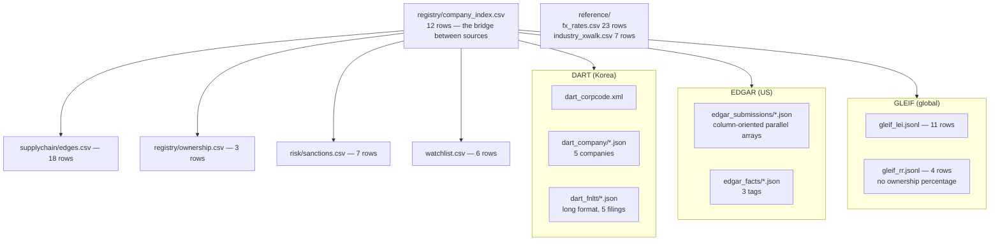
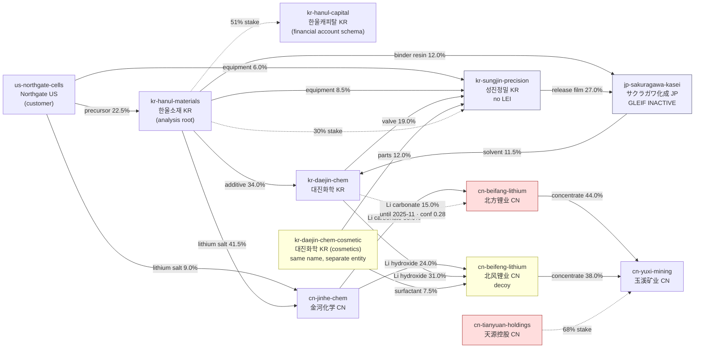

# Company Analysis

An AI agent that runs corporate due diligence and supply-chain risk investigation over a data lake

It takes a single question, investigates the data lake, and writes a markdown report
with its evidence attached. It opens several sources, joins them on keys, runs the
numbers, reconciles figures that disagree, and says plainly when something cannot be
established.

Nothing tells it which file to open, how to join, or what to compute. There is no
canned query and no fixed pipeline; the agent reads the data and decides for itself.

```
         Preset task or a single question
                   |
                   ▼
corporate    --▶ [ agent ]  --▶ (final output) markdown report
data lake            |
                   ▼
               (working output)
                +-- evidence.md    claim-to-evidence table
                +-- findings.json  for run-to-run comparison
                +-- queries/*.py   the queries it ran
```

The markdown report lands under `reports/` as the final output; the working output
goes under `artifacts/`.

In order, the agent skims the data to learn what lives where, pins down the target
entity by cross-checking names, registration numbers and LEIs, expands ownership and
supply relationships tier by tier, computes concentration and financial ratios and
confirms them by a second route, then fills in the report with the evidence attached.
It does not run straight down this list. When figures disagree or the evidence is thin,
it goes back a step.

---

## The data lake

Everything under `data/` is the subject of the investigation, and it is **read-only.**
The agent only reads there; the run hashes every file before and after to confirm not
one character changed.

```
data/
  registry/       entity registration
    dart_corpcode.xml       entity code, name, ticker
    dart_company/           industry, incorporation date, address, business reg. no.
    edgar_submissions/      CIK, filing history
    gleif_lei.jsonl         LEI, legal name (local/English), registration no., status
    gleif_rr.jsonl          entity-to-entity relationships
    company_index.csv       the bridge between sources
    ownership.csv           ownership stakes
  financials/
    dart_fnltt/             statements (consolidated/separate, long format by account)
    edgar_facts/            time series by XBRL tag
  supplychain/
    edges.csv               buyer, supplier, item, procurement share, confidence, end date
  risk/
    sanctions.csv           sanctions list (name, aliases, program, listing date)
  reference/
    fx_rates.csv            monthly FX rates
    industry_xwalk.csv      industry code crosswalk (KSIC, SIC, NAICS)
  watchlist.csv             ongoing monitoring targets
```



Entity registration, financial statements, ownership and supply relationships, a
sanctions list, FX rates and industry codes: what due diligence actually needs. Every
company and transaction in here is **synthetic** and unrelated to any real company or
person. The **shapes, though, are taken from the real thing** — actual responses from
OpenDART (Korea), SEC EDGAR (US) and GLEIF (global), reproduced structure for
structure.

Which means the awkwardness of real data comes with it. Consolidated and separate
statements arrive in one response, the same account appears twice in one response,
business registration numbers are formatted differently per source, two distinct
entities have names one letter apart, two distinct entities share a name exactly, and
the supply graph contains cycles. That is where the difficulty lives.

The schema of each file, how to join them, and the mistakes people make are documented
alongside the data. That document is what the agent reads before it starts.

### The twelve-company graph



---

## How it works

The agent holds seven tools.

| Tool | What it is for |
| --- | --- |
| `read` | opens a file |
| `glob` | finds files by name |
| `grep` | finds files by content |
| `shell` | runs a command |
| `python` | joins, aggregates, checks the arithmetic |
| `write` | writes a new file |
| `edit` | changes a file already written |

`openai/` models get a different set. The crate swaps tools to match the model family,
so `write`, `edit`, `glob` and `grep` are replaced by a single `apply_patch`.

Nothing is loaded or indexed up front. The filesystem itself is the subject: `glob` and
`grep` locate what is where, then `read` opens it. Because the shapes differ per source
(XML, JSONL, CSV, long-format JSON), parsing and joining get written on the spot with
`python`. Those queries are kept as files rather than thrown away, so a number in the
report can be traced back later.

The data is built so the analysis can be finished with the standard library alone
(`csv`, `json`, `xml`). duckdb and pandas get used if present but are not needed. The
interpreter behind `python` is the host's.

The report is not written all at once at the end. A skeleton goes down with `write`
before the first query runs, and each section is filled in with `edit` as its evidence
firms up. If the run is cut short, the progress survives.

---

## Running it

### Prerequisites

**Rust 1.95 or later.** `rust-toolchain.toml` pins the toolchain, so `cargo` picks the
right one on its own — no `+version` needed.

**One API key.** Any provider works. The crate registers providers from the
environment, so pass a model prefix matching the key you set via `--model`.

| Model prefix | Model (e.g.) | Environment variable |
| --- | --- | --- |
| `anthropic/` | `claude-sonnet-5`, `claude-haiku-4-5` | `ANTHROPIC_API_KEY` |
| `openai/` | `gpt-5`, `gpt-4.1-mini` | `OPENAI_API_KEY` |
| `google/` | `gemini-3.5-flash`, `gemini-3.1-pro-preview` | `GEMINI_API_KEY` |
| `x-ai/` | `grok-4` | `XAI_API_KEY` |
| `deepseek/` | `deepseek-v4-flash`, `deepseek-v4-pro` | `DEEPSEEK_API_KEY` |
| `moonshotai/` | `kimi-k3` | `KIMI_API_KEY` |

Pass the prefix and the model name joined together, as in
`--model anthropic/claude-sonnet-5`. The model names above are examples; which names
are valid is up to the provider, so check the provider's own documentation for a
current list.

A `.env` at the repository root is read as well.

**A console server.** The built-in tools do not run without a console to run commands
in. Nothing to install by hand: `build.rs` fetches and builds `cortex-local-console`
from the same revision the manifest pins, and the binary lands under `target/`. The
first build therefore takes longer; later ones reuse it.

To use a console you built yourself instead, point at it and `build.rs` skips its own.

```sh
export AILOY_CORTEX_CONSOLE=/path/to/cortex-local-console
```

### The investigation

```sh
cd company_analysis

cargo run -- --preset due-diligence --company "한울소재"
```

A free-form question works too.

```sh
cargo run -- --task "한울소재의 중국 의존도를 2차 협력사까지 분석해줘"
```

A summary prints when it finishes.

```
--- 실행 요약 ---
턴 86 / 툴 호출 44
토큰 (LM 호출 42회): 입력 2,093,429 / 출력 30,728
  최대 컨텍스트 83,495 (마지막 호출 기준 대화 크기)
종료 사유 Stop
산출물 8개:
  ./artifacts/<run>/report.md
  ...
data/ 무결성: 통과 (25개 파일 그대로, 사후 검출 기준)
리포트 사본 reports/1787207971-한울소재-due-diligence.md
```

### Presets

Instead of writing the question every time, there are four common ones to pick from. A
preset fixes both the question and the list of body sections in the report.

| Preset | What it asks | Report body |
| --- | --- | --- |
| `company-profile` | What does this company do and how does it make money | Overview and governance, financial trend, business and products, major counterparties, strengths and weaknesses |
| `supply-chain-risk` | Where do the inputs come from and what breaks if one is cut | Tier-by-tier expansion, concentration, sanctions and geopolitical exposure, alternative supplier candidates, scenario impact |
| `due-diligence` | Should we do business with this company | Entity verification, ownership and beneficial ownership, sanctions and litigation history, financial health, affiliate network, red flags |
| `watchlist-monitor` | What changed among the things we watch | Targets that changed (in detail), targets that did not (one line each), new risks |

The first three take a target via `--company`. `watchlist-monitor` covers all of
`data/watchlist.csv` and so takes no company; instead, `--since` hands it the previous
run's `findings.json` so it reports **only what changed.**

```sh
cargo run -- \
  --preset watchlist-monitor \
  --since ./artifacts/<previous-run>/findings.json
```

### CLI

| Option | Description |
| --- | --- |
| `--task <sentence>` | free-form question |
| `--task-file <path>` | read the question from a file |
| `--preset <name>` | one of the four: {`company-profile`, `supply-chain-risk`, `due-diligence`, `watchlist-monitor`} |
| `--company <name>` | preset target (required except for `watchlist-monitor`) |
| `--since <findings.json>` | the previous run's result |
| `--model <id>` | `<prefix>/<model-name>`. `anthropic/claude-sonnet-5` by default |
| `--data <path>` | `./data` by default |
| `--out <path>` | `./artifacts` by default |
| `--workspace <path>` | `./workspace` by default |

One of `--task` or `--preset` is required.

---

## Output

The final output is a single **`report.md`**: a markdown report for a person to read,
answering the question in its summary and laying out the evidence in the body. Every
figure carries a source, anything absent from the data is written as absent, and a
sanctions match resting only on name similarity is labelled
`가능성 있는 일치, 확인 필요` (possible match, needs confirmation).

The rest is what it takes to verify that report and carry on from it.

```
artifacts/<epoch>-<company>-<preset>/
  report.md        ← the final output
  evidence.md      claim-to-evidence (file, query) table. Traces a sentence back to its source
  findings.json    machine-readable result. Used to compare against the next run (--since)
  queries/         the queries it ran, kept as-is, so a number can be reproduced
    01-*.py
```

Run directories are scattered by slug, which makes it awkward to skim the reports
alone. So on exit `report.md` is copied once to `reports/<run>.md`. The original stays
where it is; the copy exists to line reports up side by side or diff the history.

```
reports/
  1787199691-대진화학-supply-chain-risk.md
  1787207971-성진정밀-due-diligence.md
```

`findings.json` has a fixed schema. Run-to-run comparison depends on it.

```jsonc
{
  "run_id": "...",
  "task": "...",
  "entities": [],
  "findings": [{ "severity", "statement", "evidence": [], "confidence" }],
  "data_gaps": []
}
```

Writing is permitted in exactly two places: `artifacts/` and `workspace/` (working
files). Whether output escaped those is checked after the run, and an escape exits
non-zero. Like the `data/` integrity check, this is **detection after the fact.** It
does not prevent anything; it tells you something went wrong.

---

## Verifying the data

You can check that the data does not contradict itself, and that the problems planted
in it are actually solvable, without running the agent at all.

```sh
# internal consistency: accounting identities, referential integrity, CSV arity, graph cycles — 666 checks
python3 datagen/validate.py

# whether the intended solution path actually works (standard library only)
python3 eval/solution_walkthrough.py
```

The answer key is [`eval/ground_truth.yaml`](eval/ground_truth.yaml). For each of the
14 cases planted in the data it states what has to be found and what must not be
asserted: consolidated/separate mixing, duplicate accounts, a one-letter-apart decoy,
two entities sharing a name, a graph cycle, a missing fiscal year, formatting
mismatches. Hallucination probes are in there too, checking whether invented entities
and fields get used as if real.

**Keeping it outside `data/` matters.** Inside, the agent would grep the answers.

`solution_walkthrough.py` solves all 14 with the standard library alone. That proves
the answer key is actually reachable, and at the same time that this data can be
analysed end to end without duckdb.

To regenerate the data:

```sh
python3 datagen/emit.py
```
